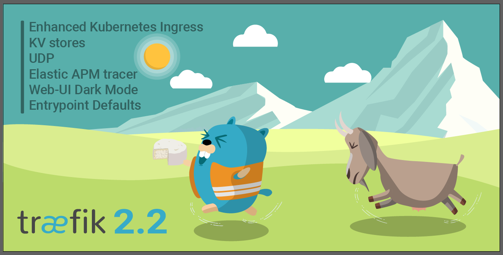

# Traefik History

<p align="center">
    <picture>
    
    </picture>
</p>

<!--

-->

<!--
git tag -l --sort=-creatordate --format='%(creatordate:iso8601), %(authoremail), %(committeremail), %(refname:short), %(objectname)' > tags.csv
-->


## TOC

- [First Commit](#first-commit)
- [Public Announcement](#public-announcement)
- [v1.0-alpha](#v10-alpha-traefik)
- [v1.0](#v10-reblochon)
- [v1.1](#v11-camembert)
- [v1.2](#v12-morbier)
- [v1.3](#v13-raclette)
- [v1.4](#v14-roquefort)
- [v1.5](#v15-cancoillotte)
- [v1.6](#v16-tetedemoine)
- [v1.7](#v17-maroilles)
- [v2.0-alpha-beta](#v20-alphabeta-faisselle)
- [v2.0](#v20-montdor)
- [v2.1](#v21-cantal)
- [v2.2](#v22-chevrotin)
- [v2.3](#v23-picodon)
- [v2.4](#v24-livarot)
- [v2.5](#v25-brie)
- [v2.6](#v26-rocamadour)
- [v2.7](#v27-epoisses)
- [v2.8](#v28-vacherin)
- [v2.9](#v29-banon)
- [v2.10](#v210-saintmarcelin)
- [v3.0](#v30-beaufort)

## First Commit

- date: 2015-08-28 18:09:22 +0200
- SHA: 3680c8dc604ee9d0277973a55641f47fd257b564

## Public Announcement

- 2015-09-22
- [Hacker News](https://news.ycombinator.com/item?id=10257865)

## v1.0-alpha, traefik

| version     | date                      | fix |
|-------------|---------------------------|-----|
| v1.0        | 2015-09-22 23:29:45 +0200 |     |
| v1.0-alpha  |                           | 86  |
| v1.0.0-beta |                           | 71  |

## v1.0, reblochon

<p align="center">
    <picture>
    
    </picture>
</p>


| version    | date                      | fix |
|------------|---------------------------|-----|
| v1.0.0-rc1 | 2016-05-31 00:15:58 +0200 | 3   |
| v1.0.0     | 2016-07-06 01:09:33 +0200 | 3   |
| v1.0.3     | 2016-09-22 15:00:43 +0200 |     |

[CHANGELOG](https://github.com/containous/traefik/blob/v1.0/CHANGELOG.md)

## v1.1, camembert

<p align="center">
    <picture>
    
    </picture>
</p>


| version    | date                      | fix |
|------------|---------------------------|-----|
| v1.1.0-rc1 | 2016-09-30 15:57:09 +0200 | 4   |
| v1.1.0     | 2016-11-17 22:41:11 +0100 | 2   |
| v1.1.2     | 2016-12-15 11:13:30 +0100 |     |

[CHANGELOG](https://github.com/containous/traefik/blob/v1.1/CHANGELOG.md)

## v1.2, morbier

<p align="center">
    <picture>
    
    </picture>
</p>


Dates:

| version    | date                      | fix |
|------------|---------------------------|-----|
| v1.2.0-rc1 | 2017-02-06 21:36:30 +0100 | 2   |
| v1.2.0     | 2017-03-21 10:37:24 +0100 | 3   |
| v1.2.3     | 2017-04-13 21:09:40 +0200 |     |

[CHANGELOG](https://github.com/containous/traefik/blob/v1.2/CHANGELOG.md)

## v1.3, raclette

<p align="center">
    <picture>
    
    </picture>
</p>


| version    | date                      | fix |
|------------|---------------------------|-----|
| v1.3.0-rc1 | 2017-05-05 15:19:55 +0200 | 3   |
| v1.3.0     | 2017-05-31 10:11:16 -0700 | 8   |
| v1.3.8     | 2017-09-07 22:04:03 +0200 |     |

[CHANGELOG](https://github.com/containous/traefik/blob/v1.3/CHANGELOG.md)

## v1.4, roquefort

<p align="center">
    <picture>
    
    </picture>
</p>


| version    | date                      | fix |
|------------|---------------------------|-----|
| v1.4.0-rc1 | 2017-08-29 09:37:47 +0200 | 5   |
| v1.4.0     | 2017-10-16 18:42:03 +0200 | 6   |
| v1.4.6     | 2018-01-02 12:54:03 +0100 |     |

[CHANGELOG](https://github.com/containous/traefik/blob/v1.4/CHANGELOG.md)

## v1.5, cancoillotte

<p align="center">
    <picture>
    
    </picture>
</p>


| version    | date                      | fix |
|------------|---------------------------|-----|
| v1.5.0-rc1 | 2017-11-28 14:50:06 +0100 | 5   |
| v1.5.0     | 2018-01-23 17:34:04 +0100 | 4   |
| v1.5.4     | 2018-03-15 14:26:03 +0100 |     |

[CHANGELOG](https://github.com/containous/traefik/blob/v1.5/CHANGELOG.md)

## v1.6, tetedemoine

<p align="center">
    <picture>
    
    </picture>
</p>


| version    | date                      | fix |
|------------|---------------------------|-----|
| v1.6.0-rc1 | 2018-03-26 16:40:03 +0200 | 6   |
| v1.6.0     | 2018-04-30 23:20:05 +0200 | 6   |
| v1.6.6     | 2018-08-20 14:46:02 +0200 |     |

[CHANGELOG](https://github.com/containous/traefik/blob/v1.6/CHANGELOG.md)

## v1.7, maroilles

<p align="center">
    <picture>
    
    </picture>
</p>


| version    | date                      | fix |
|------------|---------------------------|-----|
| v1.7.0-rc1 | 2018-07-09 16:54:04 +0200 | 5   |
| v1.7.0     | 2018-09-24 11:44:03 +0200 | 33+ |
| v1.7.33    | 2021-10-07 16:32:07 +0200 |     |

[CHANGELOG](https://github.com/containous/traefik/blob/v1.7/CHANGELOG.md)

## v2.0-alpha/beta, faisselle

| version       | date                      | fix |
|---------------|---------------------------|-----|
| v2.0.0-alpha1 | 2019-03-18 15:18:04 +0100 | 8   |
| v2.0.0-beta1  | 2019-07-19 17:18:03 +0200 | 1   |

## v2.0, montdor

<p align="center">
    <picture>
    
    </picture>
</p>


| version    | date                      | fix |
|------------|---------------------------|-----|
| v2.0.0-rc1 | 2019-08-26 10:36:03 -0700 | 4   |
| v2.0.0     | 2019-09-16 18:28:04 +0200 | 7   |
| v2.0.7     | 2019-12-09 18:34:04 +0100 |     |

[CHANGELOG](https://github.com/containous/traefik/blob/v2.0/CHANGELOG.md)

## v2.1, cantal

<p align="center">
    <picture>
    
    </picture>
</p>


| version    | date                      | fix |
|------------|---------------------------|-----|
| v2.1.0-rc1 | 2019-11-15 18:44:03 +0100 | 3   |
| v2.1.0     | 2019-12-11 18:40:04 +0100 | 9   |
| v2.1.9     | 2020-03-23 17:40:04 +0100 |     |

[CHANGELOG](https://github.com/containous/traefik/blob/v2.1/CHANGELOG.md)

## v2.2, chevrotin

<p align="center">
    <picture>
    
    </picture>
</p>


| version    | date                      | fix |
|------------|---------------------------|-----|
| v2.2.0-rc1 | 2020-03-05 19:50:51 +0100 | 4   |
| v2.2.0     | 2020-03-25 17:46:04 +0100 | 11  |
| v2.2.11    | 2020-09-07 16:00:03 +0200 |     |

[CHANGELOG](https://github.com/containous/traefik/blob/v2.2/CHANGELOG.md)

## v2.3, picodon

<p align="center">
    <picture>
    
    </picture>
</p>


| version    | date                      | fix |
|------------|---------------------------|-----|
| v2.3.0-rc1 | 2020-07-15 20:50:03 +0200 | 7   |
| v2.3.0     | 2020-09-23 12:44:04 +0200 | 7   |
| v2.3.7     | 2021-01-11 18:48:03 +0100 |     |

[CHANGELOG](https://github.com/containous/traefik/blob/v2.3/CHANGELOG.md)

## v2.4, livarot

<p align="center">
    <picture>
    
    </picture>
</p>


| version    | date                      | fix |
|------------|---------------------------|-----|
| v2.4.0-rc1 | 2020-12-16 16:42:04 +0100 | 2   |
| v2.4.0     | 2021-01-19 16:50:04 +0100 | 14  |
| v2.4.14    | 2021-08-16 17:26:14 +0200 |     |

[CHANGELOG](https://github.com/containous/traefik/blob/v2.4/CHANGELOG.md)

## v2.5, brie

<p align="center">
    <picture>
    
    </picture>
</p>


| version    | date                      | fix |
|------------|---------------------------|-----|
| v2.5.0-rc1 | 2021-06-28 18:00:12 +0200 | 6   |
| v2.5.0     | 2021-08-17 18:04:05 +0200 | 7   |
| v2.5.7     | 2021-09-20 17:30:06 +0200 |     |

[CHANGELOG](https://github.com/containous/traefik/blob/v2.5/CHANGELOG.md)

## v2.6, rocamadour

<p align="center">
    <picture>
    
    </picture>
</p>


| version    | date                      | fix |
|------------|---------------------------|-----|
| v2.6.0-rc1 | 2021-12-20 17:02:06 +0100 | 3   |
| v2.6.0     | 2022-01-24 17:58:04 +0100 | 7   |
| v2.6.7     | 2022-05-24 16:14:08 +0200 |     |

[CHANGELOG](https://github.com/containous/traefik/blob/v2.6/CHANGELOG.md)

## v2.7, epoisses

<p align="center">
    <picture>
    
    </picture>
</p>


| version    | date                      | fix |
|------------|---------------------------|-----|
| v2.7.0-rc1 | 2022-03-24 20:54:08 +0100 | 2   |
| v2.7.0     | 2022-05-24 18:58:08 +0200 | 3   |
| v2.7.3     | 2022-06-29 15:44:08 +0200 |     |

[CHANGELOG](https://github.com/containous/traefik/blob/v2.7/CHANGELOG.md)

## v2.8, vacherin

<p align="center">
    <picture>
    
    </picture>
</p>


| version    | date                      | fix |
|------------|---------------------------|-----|
| v2.8.0-rc1 | 2022-06-13 17:26:12 +0200 | 2   |
| v2.8.0     | 2022-06-29 17:38:37 +0200 | 8   |
| v2.8.8     | 2022-09-30 12:03:03 +0200 |     |

[CHANGELOG](https://github.com/containous/traefik/blob/v2.8/CHANGELOG.md)

## v2.9, banon

<p align="center">
    <picture>
    
    </picture>
</p>


| version    | date                      | fix |
|------------|---------------------------|-----|
| v2.9.0-rc1 | 2022-06-13 17:26:12 +0200 | 2   |
| v2.9.0     | 2022-06-29 17:38:37 +0200 | 10  |
| v2.9.10    | 2023-04-06 18:10:03 +0200 |     |

[CHANGELOG](https://github.com/containous/traefik/blob/v2.9/CHANGELOG.md)

## v2.10, saintmarcelin

<p align="center">
    <picture>
    
    </picture>
</p>


| version     | date                      | fix |
|-------------|---------------------------|-----|
| v2.10.0-rc1 | 2022-06-13 17:26:12 +0200 | 2   |
| v2.10.0     | 2022-06-29 17:38:37 +0200 | 7   |
| v2.10.7     | 2023-12-06 16:42:09 +0100 |     |

[CHANGELOG](https://github.com/containous/traefik/blob/v2.10/CHANGELOG.md)

## v2.11, mimolette

```mermaid
gantt
    title Timeline
    todayMarker off
    tickInterval 1month
    axisFormat %Y-%m
    dateFormat YYYY-MM-DD HH:mm:ss
    section v2.10
        v2.11.0-rc1: milestone, 2024-01-03 11:12:05, 0d
        v2.11.0-rc2: milestone, 2024-01-24 15:20:09, 0d
        v2.11.0: crit, milestone, 2024-02-12 16:14:04, 0d

```

| version     | date                      | fix |
|-------------|---------------------------|-----|
| v2.11.0-rc1 | 2024-01-03 11:12:05 +0100 | 2   |
| v2.11.0     | 2024-02-12 16:14:04 +0100 |     |

[CHANGELOG](https://github.com/containous/traefik/blob/v2.11/CHANGELOG.md)

## v3.0, beaufort

<p align="center">
    <picture>
    
    </picture>
</p>

```mermaid
gantt
    title Timeline
    todayMarker off
    tickInterval 1month
    axisFormat %Y-%m
    dateFormat YYYY-MM-DD HH:mm:ss
    section v3.0
        v3.0.0-beta1: milestone, 2022-12-05 16:58:04, 0d
        v3.0.0-beta2: milestone, 2022-12-07 17:26:04, 0d
        v3.0.0-beta3: milestone, 2023-06-22 01:18:05, 0d
        v3.0.0-beta4: milestone, 2023-10-12 09:48:05, 0d
        v3.0.0-beta5: milestone, 2023-11-29 16:08:05, 0d
        v3.0.0-rc1: milestone, 2024-02-13 14:38:03, 0d
```

| version      | date                      | fix |
|--------------|---------------------------|-----|
| v3.0.0-beta1 | 2022-12-05 16:58:04 +0100 | 5+  |
| v3.0.0-rc1   | 2024-02-13 14:38:03 +0100 |     |
